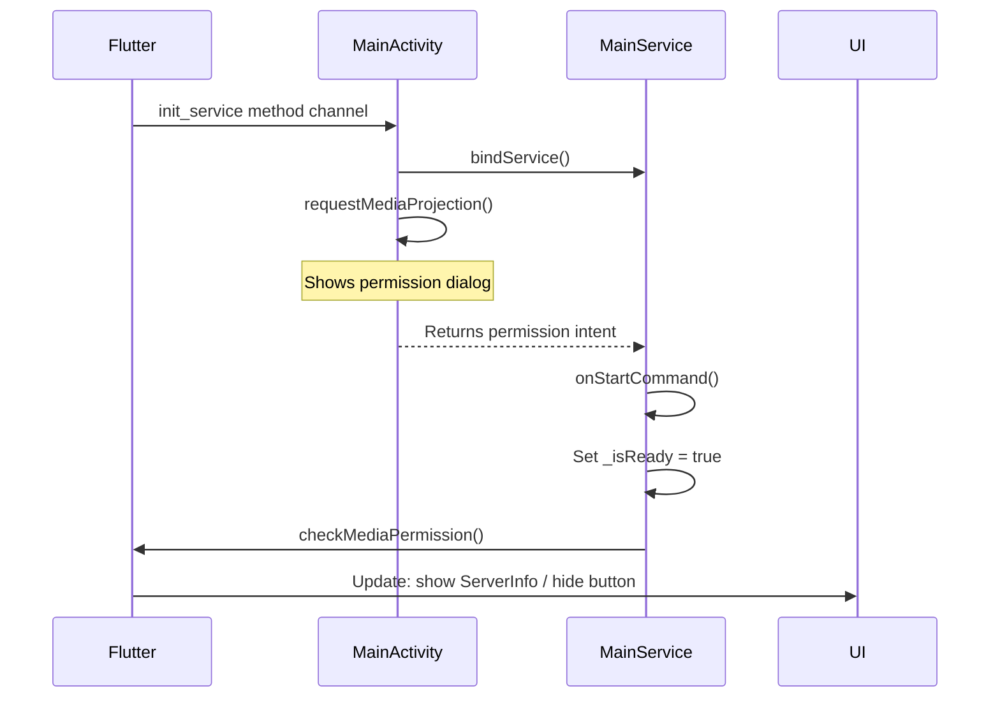
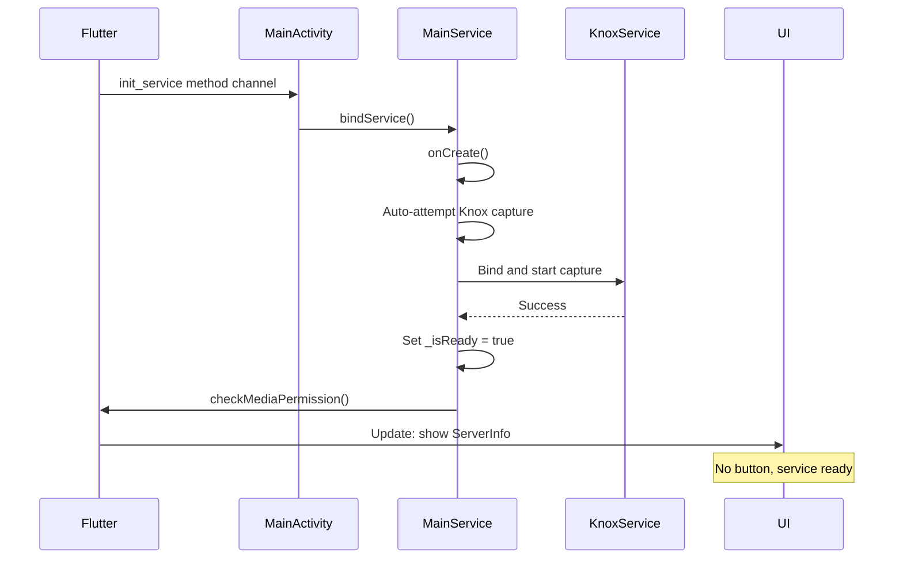
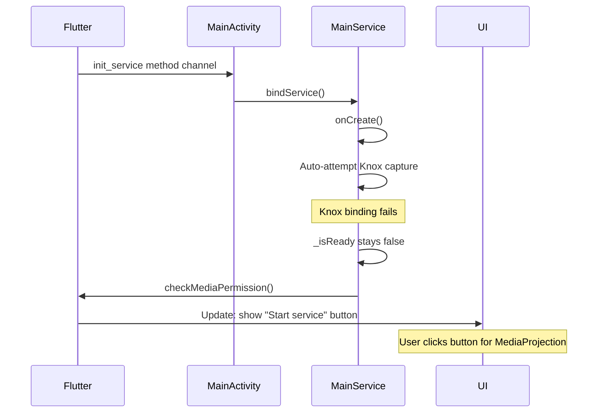

# Knox Auto-Start on Service Creation

## Objective

Modify RustDesk Android to automatically attempt Knox capture when `MainService` is created, bypassing MediaProjection permission requests. If Knox fails, the app falls back silently to the standard "Start service" button flow.

## Approach: Minimal Changes Strategy

This plan prioritizes Android-native changes only, with **zero Flutter/Dart modifications**. The key insight is that `MainService._isReady` controls whether the Flutter UI shows the "Start service" button. By making Knox auto-start set `_isReady = true` on success, or keep it `false` on failure, we achieve the desired behavior without touching Flutter code.

## Current Flow Analysis

### Existing Behavior

When `MainService` is created (via `init_service` method channel call):




Key state variables:

- `MainService._isReady`: Controls UI state (false = show button, true = show server info)
- `MainService._isStart`: Controls capture state (false = not capturing, true = capturing)

### Target Behavior

When Knox is available:




When Knox is unavailable:




## Implementation Changes

### File 1: `[flutter/android/app/src/main/kotlin/com/carriez/flutter_hbb/MainService.kt](flutter/android/app/src/main/kotlin/com/carriez/flutter_hbb/MainService.kt)`

**Change 1: Add auto-start attempt in `onCreate()**`

After line 262 (`createForegroundNotification()`), add Knox auto-start logic:

```kotlin
override fun onCreate() {
    super.onCreate()
    Log.d(logTag,"MainService onCreate, sdk int:${Build.VERSION.SDK_INT} reuseVirtualDisplay:$reuseVirtualDisplay")
    FFI.init(this)
    HandlerThread("Service", Process.THREAD_PRIORITY_BACKGROUND).apply {
        start()
        serviceLooper = looper
        serviceHandler = Handler(looper)
    }
    updateScreenInfo(resources.configuration.orientation)
    initNotification()

    val prefs = applicationContext.getSharedPreferences(KEY_SHARED_PREFERENCES, FlutterActivity.MODE_PRIVATE)
    val configPath = prefs.getString(KEY_APP_DIR_CONFIG_PATH, "") ?: ""
    FFI.startServer(configPath, "")

    createForegroundNotification()
    
    // NEW: Auto-attempt Knox capture on service creation
    tryAutoStartKnoxCapture()
}

private fun tryAutoStartKnoxCapture() {
    Log.d(logTag, "Attempting auto-start with Knox")
    
    if (!isKnoxAvailable()) {
        Log.i(logTag, "Knox service not available, waiting for manual start")
        return
    }
    
    // Attempt Knox capture without calling startCapture()
    // This avoids setting _isStart = true prematurely
    knoxCapturer = KnoxCapturer()
    
    if (!knoxCapturer!!.bind()) {
        Log.w(logTag, "Knox auto-start: Failed to bind service")
        knoxCapturer = null
        return
    }
    
    if (!knoxCapturer!!.initCapture()) {
        Log.w(logTag, "Knox auto-start: Failed to initialize capture")
        knoxCapturer?.unbind()
        knoxCapturer = null
        return
    }
    
    // Success: mark as ready and using Knox
    isUsingKnox = true
    _isReady = true
    Log.i(logTag, "Knox auto-start successful, service ready")
    
    // Notify Flutter that media permission is "ready" (Knox doesn't need permission dialog)
    checkMediaPermission()
    
    // Note: We do NOT set _isStart = true here
    // The actual capture will start when user's connection arrives,
    // or when startCapture() is called through the normal flow
}
```

**Change 2: Modify `startCapture()` to handle auto-started Knox**

Update `startCapture()` (line 480) to check if Knox is already initialized:

```kotlin
fun startCapture(): Boolean {
    if (isStart) {
        return true
    }
    
    updateScreenInfo(resources.configuration.orientation)
    Log.d(logTag, "Start Capture")
    
    // Check if Knox was auto-started in onCreate
    if (isUsingKnox && knoxCapturer != null) {
        Log.i(logTag, "Using pre-initialized Knox capture")
        if (knoxCapturer!!.startCapture()) {
            _isStart = true
            FFI.setFrameRawEnable("video", true)
            MainActivity.rdClipboardManager?.setCaptureStarted(_isStart)
            return true
        } else {
            // Knox capture start failed, cleanup and fallback
            Log.w(logTag, "Knox capture start failed, falling back to MediaProjection")
            knoxCapturer?.releaseCapture()
            knoxCapturer?.unbind()
            knoxCapturer = null
            isUsingKnox = false
            _isReady = false
        }
    }
    
    // Try fresh Knox capture if not already initialized
    if (isKnoxAvailable() && startKnoxCapture()) {
        Log.i(logTag, "Using Knox screen capture")
        isUsingKnox = true
        _isStart = true
        FFI.setFrameRawEnable("video", true)
        MainActivity.rdClipboardManager?.setCaptureStarted(_isStart)
        return true
    }
    
    // Fallback to MediaProjection
    Log.i(logTag, "Using MediaProjection screen capture")
    isUsingKnox = false
    return startMediaProjectionCapture()
}
```

**Change 3: Ensure `KnoxCapturer` supports separate init and start**

The existing `KnoxCapturer.initCapture()` likely calls `captureService.startCapture()`. We need to split this into two phases:

1. `initCapture()`: Bind service and register callback (done in `onCreate`)
2. `startCapture()`: Actually start capturing frames (done when user connects)

Update `KnoxCapturer` around line 890:

```kotlin
fun initCapture(): Boolean {
    val service = captureService
    if (service == null) {
        Log.e(logTag, "Cannot init capture: service is null")
        return false
    }
    
    try {
        updateScreenInfoForKnox(service)
        // Only register callback, don't start yet
        service.registerCallback(knoxFrameCallback)
        Log.i(logTag, "Knox capture initialized (callback registered)")
        return true
    } catch (e: Exception) {
        Log.e(logTag, "Failed to initialize Knox capture", e)
        return false
    }
}

fun startCapture(): Boolean {
    val service = captureService
    if (service == null) {
        Log.e(logTag, "Cannot start capture: service is null")
        return false
    }
    
    try {
        service.startCapture()
        Log.i(logTag, "Knox capture started")
        return true
    } catch (e: Exception) {
        Log.e(logTag, "Failed to start Knox capture", e)
        return false
    }
}
```

**Change 4: Update `onStartCommand()` to skip MediaProjection when Knox is ready**

Modify `onStartCommand()` (line 340) to bypass MediaProjection request if Knox is already initialized:

```kotlin
override fun onStartCommand(intent: Intent?, flags: Int, startId: Int): Int {
    Log.d("whichService", "this service: ${Thread.currentThread()}")
    super.onStartCommand(intent, flags, startId)
    if (intent?.action == ACT_INIT_MEDIA_PROJECTION_AND_SERVICE) {
        createForegroundNotification()

        if (intent.getBooleanExtra(EXT_INIT_FROM_BOOT, false)) {
            FFI.startService()
        }
        
        // NEW: Skip MediaProjection if Knox is already ready
        if (isUsingKnox && _isReady) {
            Log.i(logTag, "Knox already initialized, skipping MediaProjection request")
            return START_NOT_STICKY
        }
        
        Log.d(logTag, "service starting: ${startId}:${Thread.currentThread()}")
        val mediaProjectionManager =
            getSystemService(MEDIA_PROJECTION_SERVICE) as MediaProjectionManager

        intent.getParcelableExtra<Intent>(EXT_MEDIA_PROJECTION_RES_INTENT)?.let {
            mediaProjection =
                mediaProjectionManager.getMediaProjection(Activity.RESULT_OK, it)
            checkMediaPermission()
            _isReady = true
        } ?: let {
            Log.d(logTag, "getParcelableExtra intent null, invoke requestMediaProjection")
            requestMediaProjection()
        }
    }
    return START_NOT_STICKY
}
```

### File 2: `[flutter/android/app/src/main/kotlin/com/carriez/flutter_hbb/MainActivity.kt](flutter/android/app/src/main/kotlin/com/carriez/flutter_hbb/MainActivity.kt)`

**Change: Skip `requestMediaProjection()` if Knox is ready**

Modify `init_service` handler (line 132) to check Knox status:

```kotlin
"init_service" -> {
    Intent(activity, MainService::class.java).also {
        bindService(it, serviceConnection, Context.BIND_AUTO_CREATE)
    }
    if (MainService.isReady) {
        // Service already ready (Knox auto-started)
        result.success(false)
        return@setMethodCallHandler
    }
    // Only request MediaProjection if not using Knox
    requestMediaProjection()
    result.success(true)
}
```

This check already exists at line 135-138, so no modification needed here. The existing code handles this correctly.

## Flow Verification

### Success Case (Knox Available)

1. Flutter calls `init_service` method channel
2. `MainActivity` binds `MainService`
3. `MainService.onCreate()` calls `tryAutoStartKnoxCapture()`
4. Knox service binds successfully, callback registered
5. `_isReady = true`, `isUsingKnox = true`
6. `checkMediaPermission()` notifies Flutter: `media = true`
7. Flutter UI hides "Start service" button, shows ServerInfo
8. When connection arrives, `startCapture()` detects pre-initialized Knox and starts capture
9. No MediaProjection permission dialog ever shown

### Failure Case (Knox Unavailable)

1. Flutter calls `init_service` method channel
2. `MainActivity` binds `MainService`
3. `MainService.onCreate()` calls `tryAutoStartKnoxCapture()`
4. `isKnoxAvailable()` returns false
5. `_isReady` remains false, `isUsingKnox = false`
6. `checkMediaPermission()` notifies Flutter: `media = false`
7. Flutter UI shows "Start service" button
8. User clicks button → standard MediaProjection flow
9. MediaProjection permission dialog shown

## Testing Checklist

- With Knox app installed: Service auto-starts, no button shown, capture works
- Without Knox app: Button shown, MediaProjection flow works
- Knox binding timeout: Falls back to button correctly
- Knox service crashes after init: Next `startCapture()` falls back to MediaProjection
- Device boot with "Start on boot" enabled: Works with Knox auto-start
- Multiple service create/destroy cycles: State resets correctly

## Risk Assessment

**Low Risk Changes:**

- All changes confined to Android native layer (`MainService.kt`, `MainActivity.kt`)
- No Flutter/Dart modifications required
- No changes to AIDL interfaces or Knox service (Codebase B)
- Existing MediaProjection flow preserved as fallback
- No changes to Rust FFI layer

**Edge Cases Handled:**

- Knox service unavailable: Silent fallback
- Knox binding timeout: Silent fallback
- Knox service disconnects after init: Next capture attempt falls back
- User manually stops and restarts service: Re-attempts Knox

**Rollback Plan:**
Remove `tryAutoStartKnoxCapture()` call from `onCreate()` to revert to previous behavior.