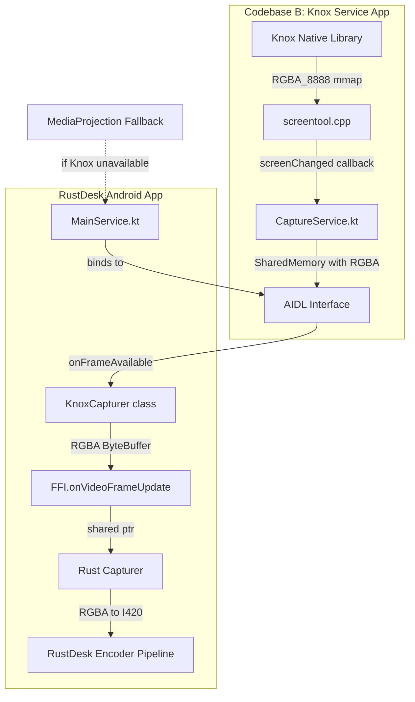

# Knox Screen Capture Integration Plan

## Overview

Integrate Knox screen capture into RustDesk Android as an alternative to MediaProjection, maintaining RGBA_8888 format throughout the pipeline for seamless integration with existing RustDesk encoder infrastructure.

## Architecture




## Changes Required

### Phase 1: Codebase B Modifications (Knox Service)

#### 1.1 Modify Native Layer to Remove NV12 Conversion

**File:** `Android-Template/app/src/main/cpp/screentool.cpp`

Remove NV12 conversion logic and provide RGBA directly:

- **Lines 27-29**: Delete NV12 buffer variables
- **Lines 85-129**: Delete `convertToNv12` function entirely
- **Lines 136-197 (screenChanged callback)**: Remove NV12 conversion, keep only RGBA capture
- **Lines 360-370 (nativeInit)**: Remove NV12 buffer allocation
- **Lines 472-500 (nativeCaptureAndConvertToNV12)**: Replace with direct RGBA copy function

**New function to add:**

```cpp
// Replace nativeCaptureAndConvertToNV12 with direct RGBA copy
JNIEXPORT jboolean JNICALL
Java_il_co_tmg_screentool_recorder_NativeBridge_nativeCaptureRGBA(
    JNIEnv *env, jobject, jobject dstBuffer) {
    
    if (!dstBuffer || !sFrameBuffer) {
        LOGE("Invalid buffer pointers");
        return JNI_FALSE;
    }
    
    auto *dst = static_cast<uint8_t *>(env->GetDirectBufferAddress(dstBuffer));
    if (!dst) {
        LOGE("Failed to get destination buffer address");
        return JNI_FALSE;
    }
    
    // Direct memcpy of RGBA data from Knox mmap buffer
    memcpy(dst, sFrameBuffer, sFrameBufferSize);
    
    return JNI_TRUE;
}
```

**Simplified screenChanged callback:**

```cpp
virtual void screenChanged() override {
    if (!gJavaVM || !gServiceRef) return;
    if (!sRemoteDesktop) return;
    
    DirtyRegion dirtyRegion;
    if (!sRemoteDesktop->captureScreen(dirtyRegion)) {
        LOGE("captureScreen failed");
        return;
    }
    
    // No conversion - RGBA stays in sFrameBuffer (mmap)
    
    JNIEnv* env = getJNIEnv(gJavaVM);
    if (!env) return;
    
    jclass cls = env->GetObjectClass(gServiceRef);
    if (!cls) return;
    
    jmethodID method = env->GetMethodID(cls, "onNativeFrameReady", "([I)V");
    if (!method) {
        env->ExceptionClear();
        env->DeleteLocalRef(cls);
        return;
    }
    
    jintArray rects = convertDirtyRegion(env, dirtyRegion);
    if (rects) {
        env->CallVoidMethod(gServiceRef, method, rects);
        env->DeleteLocalRef(rects);
    }
    
    env->DeleteLocalRef(cls);
}
```

#### 1.2 Update NativeBridge Interface

**File:** `Android-Template/app/src/main/java/il/co/tmg/screentool/recorder/NativeBridge.kt`

Change method name (line 23-26):

```kotlin
// Replace this:
external fun nativeCaptureAndConvertToNV12(dstBuffer: ByteBuffer): Boolean

// With this:
external fun nativeCaptureRGBA(dstBuffer: ByteBuffer): Boolean
```

#### 1.3 Update CaptureService

**File:** `Android-Template/app/src/main/java/il/co/tmg/screentool/service/CaptureService.kt`

Update buffer size calculation and copy method:

- **Line 52-53**: Change frame size calculation

```kotlin
// Replace NV12 size calculation:
frameSize = _screenWidth * _screenHeight * 3 / 2

// With RGBA size:
frameSize = _screenWidth * _screenHeight * 4
```

- **Lines 156-168**: Update capture method call

```kotlin
// Replace:
if (!NativeBridge.nativeCaptureAndConvertToNV12(byteBuffer)) {
    logger.error("Failed to copy NV12 data")
    SharedMemory.unmap(byteBuffer)
    return
}

// With:
if (!NativeBridge.nativeCaptureRGBA(byteBuffer)) {
    logger.error("Failed to copy RGBA data")
    SharedMemory.unmap(byteBuffer)
    return
}
```

### Phase 2: RustDesk Integration

#### 2.1 Copy AIDL Interface Files

Create directory structure in RustDesk:

```
rustdesk/flutter/android/app/src/main/
├── aidl/il/co/tmg/screentool/
│   ├── ICaptureService.aidl
│   ├── IFrameCallback.aidl
│   └── DirtyRegionData.aidl
└── kotlin/il/co/tmg/screentool/
    └── DirtyRegionData.kt
```

**Files to copy from captureclient:**

- `captureclient/app/src/main/aidl/il/co/tmg/screentool/ICaptureService.aidl`
- `captureclient/app/src/main/aidl/il/co/tmg/screentool/IFrameCallback.aidl`
- `captureclient/app/src/main/aidl/il/co/tmg/screentool/DirtyRegionData.aidl`
- `captureclient/app/src/main/java/il/co/tmg/screentool/DirtyRegionData.kt`

#### 2.2 Update build.gradle

**File:** `rustdesk/flutter/android/app/build.gradle`

Add AIDL support:

```gradle
android {
    buildFeatures {
        aidl true
    }
}
```

#### 2.3 Create KnoxCapturer in MainService

**File:** `rustdesk/flutter/android/app/src/main/kotlin/com/carriez/flutter_hbb/MainService.kt`

Add imports at the top:

```kotlin
import android.os.SharedMemory
import il.co.tmg.screentool.ICaptureService
import il.co.tmg.screentool.IFrameCallback
import il.co.tmg.screentool.DirtyRegionData
```

Add companion object constant (around line 50):

```kotlin
companion object {
    const val KNOX_PACKAGE = "il.co.tmg.screentool"
    const val KNOX_SERVICE = "il.co.tmg.screentool.service.CaptureService"
    private const val KNOX_BIND_TIMEOUT_MS = 5000L
}
```

Add Knox capturer class (insert after line 200):

```kotlin
private inner class KnoxCapturer {
    private var captureService: ICaptureService? = null
    private var isServiceBound = false
    private val bindLock = Object()
    
    private val serviceConnection = object : ServiceConnection {
        override fun onServiceConnected(name: ComponentName?, service: IBinder?) {
            Log.i(logTag, "Knox CaptureService connected")
            captureService = ICaptureService.Stub.asInterface(service)
            synchronized(bindLock) {
                isServiceBound = true
                bindLock.notifyAll()
            }
        }
        
        override fun onServiceDisconnected(name: ComponentName?) {
            Log.w(logTag, "Knox CaptureService disconnected")
            captureService = null
            isServiceBound = false
        }
    }
    
    private val knoxFrameCallback = object : IFrameCallback.Stub() {
        override fun onFrameAvailable(memory: SharedMemory, dirtyRegion: DirtyRegionData) {
            if (!isStart) {
                Log.d(logTag, "Frame available but not capturing, ignoring")
                return
            }
            
            // Optimization: Skip frames with no changes
            if (!dirtyRegion.hasChanges) {
                Log.d(logTag, "No changes detected, skipping frame")
                return
            }
            
            try {
                val byteBuffer = memory.mapReadWrite()
                byteBuffer.rewind()
                
                // Send RGBA buffer to RustDesk native layer
                // This uses the same FFI.onVideoFrameUpdate as MediaProjection
                FFI.onVideoFrameUpdate(byteBuffer)
                
                SharedMemory.unmap(byteBuffer)
            } catch (e: Exception) {
                Log.e(logTag, "Error processing Knox frame", e)
            }
        }
        
        override fun onCaptureError(error: String) {
            Log.e(logTag, "Knox capture error: $error")
        }
    }
    
    fun bind(): Boolean {
        val intent = Intent().apply {
            setClassName(KNOX_PACKAGE, KNOX_SERVICE)
        }
        
        val bindResult = bindService(intent, serviceConnection, Context.BIND_AUTO_CREATE)
        if (!bindResult) {
            Log.e(logTag, "Failed to bind to Knox CaptureService")
            return false
        }
        
        // Wait for service connection with timeout
        synchronized(bindLock) {
            val startTime = System.currentTimeMillis()
            while (!isServiceBound && 
                   System.currentTimeMillis() - startTime < KNOX_BIND_TIMEOUT_MS) {
                try {
                    bindLock.wait(100)
                } catch (e: InterruptedException) {
                    Thread.currentThread().interrupt()
                    break
                }
            }
        }
        
        if (!isServiceBound || captureService == null) {
            Log.e(logTag, "Knox service binding timeout")
            unbind()
            return false
        }
        
        return true
    }
    
    fun initCapture(): Boolean {
        val service = captureService ?: return false
        
        try {
            service.initCapture()
            service.registerFrameCallback(knoxFrameCallback)
            
            // Get screen dimensions from Knox
            val knoxWidth = service.getScreenWidth()
            val knoxHeight = service.getScreenHeight()
            
            if (knoxWidth <= 0 || knoxHeight <= 0) {
                Log.e(logTag, "Invalid Knox screen dimensions: ${knoxWidth}x${knoxHeight}")
                return false
            }
            
            // Update RustDesk's screen info
            updateScreenInfoForKnox(knoxWidth, knoxHeight)
            
            Log.i(logTag, "Knox capture initialized: ${knoxWidth}x${knoxHeight}")
            return true
        } catch (e: Exception) {
            Log.e(logTag, "Failed to initialize Knox capture", e)
            return false
        }
    }
    
    fun releaseCapture() {
        try {
            captureService?.unregisterFrameCallback()
        } catch (e: Exception) {
            Log.e(logTag, "Error unregistering Knox callback", e)
        }
    }
    
    fun unbind() {
        if (isServiceBound) {
            try {
                unbindService(serviceConnection)
            } catch (e: Exception) {
                Log.e(logTag, "Error unbinding Knox service", e)
            }
            isServiceBound = false
            captureService = null
        }
    }
}

private fun updateScreenInfoForKnox(width: Int, height: Int) {
    // Update SCREEN_INFO to match Knox dimensions
    SCREEN_INFO.width = width
    SCREEN_INFO.height = height
    // Keep existing DPI or calculate appropriate value
}
```

#### 2.4 Add Knox Detection and Capture Flow

**File:** `rustdesk/flutter/android/app/src/main/kotlin/com/carriez/flutter_hbb/MainService.kt`

Add instance variable (around line 200):

```kotlin
private var knoxCapturer: KnoxCapturer? = null
private var isUsingKnox = false
```

Add Knox availability check method (around line 350):

```kotlin
private fun isKnoxAvailable(): Boolean {
    val intent = Intent().apply {
        setClassName(KNOX_PACKAGE, KNOX_SERVICE)
    }
    val resolveInfo = packageManager.resolveService(intent, 0)
    val available = resolveInfo != null
    Log.d(logTag, "Knox service available: $available")
    return available
}
```

Modify `startCapture()` method (replace existing method around line 406):

```kotlin
fun startCapture(): Boolean {
    if (isStart) {
        return true
    }
    
    updateScreenInfo(resources.configuration.orientation)
    Log.d(logTag, "Start Capture")
    
    // Try Knox capture first if available
    if (isKnoxAvailable() && startKnoxCapture()) {
        Log.i(logTag, "Using Knox screen capture")
        isUsingKnox = true
        _isStart = true
        FFI.setFrameRawEnable("video", true)
        MainActivity.rdClipboardManager?.setCaptureStarted(_isStart)
        return true
    }
    
    // Fallback to MediaProjection
    Log.i(logTag, "Using MediaProjection screen capture")
    isUsingKnox = false
    return startMediaProjectionCapture()
}

private fun startKnoxCapture(): Boolean {
    knoxCapturer = KnoxCapturer()
    
    if (!knoxCapturer!!.bind()) {
        Log.w(logTag, "Failed to bind Knox service")
        knoxCapturer = null
        return false
    }
    
    if (!knoxCapturer!!.initCapture()) {
        Log.w(logTag, "Failed to initialize Knox capture")
        knoxCapturer?.unbind()
        knoxCapturer = null
        return false
    }
    
    return true
}

private fun startMediaProjectionCapture(): Boolean {
    // Existing MediaProjection logic
    if (mediaProjection == null) {
        Log.w(logTag, "startCapture fail, mediaProjection is null")
        return false
    }
    
    surface = createSurface()
    
    if (useVP9) {
        startVP9VideoRecorder(mediaProjection!!)
    } else {
        startRawVideoRecorder(mediaProjection!!)
    }
    
    if (Build.VERSION.SDK_INT >= Build.VERSION_CODES.R) {
        if (!audioRecordHandle.createAudioRecorder(false, mediaProjection)) {
            Log.d(logTag, "createAudioRecorder fail")
        } else {
            Log.d(logTag, "audio recorder start")
            audioRecordHandle.startAudioRecorder()
        }
    }
    
    checkMediaPermission()
    _isStart = true
    FFI.setFrameRawEnable("video", true)
    MainActivity.rdClipboardManager?.setCaptureStarted(_isStart)
    return true
}
```

Modify `stopCapture()` method (around line 441):

```kotlin
@Synchronized
fun stopCapture() {
    Log.d(logTag, "Stop Capture")
    FFI.setFrameRawEnable("video", false)
    _isStart = false
    MainActivity.rdClipboardManager?.setCaptureStarted(_isStart)
    
    if (isUsingKnox) {
        // Knox cleanup
        knoxCapturer?.releaseCapture()
        knoxCapturer?.unbind()
        knoxCapturer = null
        isUsingKnox = false
    } else {
        // MediaProjection cleanup (existing logic)
        if (reuseVirtualDisplay) {
            virtualDisplay?.setSurface(null)
        } else {
            virtualDisplay?.release()
        }
        imageReader?.close()
        imageReader = null
        videoEncoder?.let {
            it.signalEndOfInputStream()
            it.stop()
            it.release()
        }
        if (!reuseVirtualDisplay) {
            virtualDisplay = null
        }
        videoEncoder = null
        surface?.release()
    }
    
    _isAudioStart = false
    audioRecordHandle.tryReleaseAudio()
}
```

### Phase 3: Rust Layer (No Changes Required)

The Rust layer already expects RGBA format from Android:

- `[libs/scrap/src/common/android.rs](libs/scrap/src/common/android.rs)` line 90: `pixfmt()` returns `Pixfmt::RGBA`
- `[libs/scrap/src/android/ffi.rs](libs/scrap/src/android/ffi.rs)` line 124: `Java_ffi_FFI_onVideoFrameUpdate` receives buffer
- `[libs/scrap/src/common/convert.rs](libs/scrap/src/common/convert.rs)` lines 63-89: RGBA to I420 conversion already implemented

**No Rust changes needed** - Knox provides RGBA just like MediaProjection.

## Testing Strategy

1. **Knox Service Test**: Deploy Codebase B and verify RGBA output
2. **Binding Test**: Verify RustDesk can bind to Knox service
3. **Frame Flow Test**: Verify frames flow from Knox to RustDesk encoder
4. **Fallback Test**: Uninstall Knox service, verify MediaProjection fallback works
5. **Performance Test**: Compare frame rates between Knox and MediaProjection

## Key Benefits

- **Zero format conversion overhead**: RGBA throughout entire pipeline
- **Minimal RustDesk changes**: Only adds alternative capture source
- **Graceful fallback**: Automatic MediaProjection fallback if Knox unavailable
- **Dirty region optimization**: Knox provides changed regions (future optimization opportunity)
- **Clean abstraction**: Knox is just another capturer, like DXGI on Windows

## Potential Issues and Mitigations

1. **Service binding failure**: Handled with timeout and fallback
2. **Permission issues**: Knox service handles its own Knox permissions
3. **Screen rotation**: Knox service reports new dimensions, RustDesk can reinitialize
4. **Memory overhead**: SharedMemory IPC is zero-copy, very efficient
5. **Knox app not installed**: Detected via `isKnoxAvailable()`, falls back gracefully

## Summary of Files Modified

### Codebase B (Knox Service):

- `app/src/main/cpp/screentool.cpp` - Remove NV12, provide RGBA
- `app/src/main/java/il/co/tmg/screentool/recorder/NativeBridge.kt` - Update method name
- `app/src/main/java/il/co/tmg/screentool/service/CaptureService.kt` - Update buffer size

### RustDesk:

- `flutter/android/app/build.gradle` - Enable AIDL
- `flutter/android/app/src/main/aidl/...` - Add 3 AIDL files (copied)
- `flutter/android/app/src/main/kotlin/il/co/tmg/screentool/DirtyRegionData.kt` - Add data class (copied)
- `flutter/android/app/src/main/kotlin/com/carriez/flutter_hbb/MainService.kt` - Add KnoxCapturer, modify capture flow

### No Changes:

- All Rust encoder code remains unchanged
- FFI.onVideoFrameUpdate signature unchanged
- Conversion pipeline unchanged

