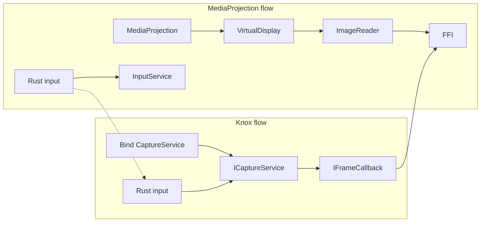

# MainService Knox flow refactor

## Understanding the two flows

**Flow 1 – MediaProjection + InputService (standard RustDesk)**  
Uses Android MediaProjection (user consent), ImageReader + VirtualDisplay for frames, and `InputService` for touch/mouse/key. Frames go to `FFI.onVideoFrameUpdate(buffer)`; input goes to `InputService.ctx?.onTouchInput` / `onMouseInput` / `onKeyEvent`.

**Flow 2 – Knox (screentool)**  
Binds to external service `il.co.tmg.screentool.service.CaptureService` (AIDL `ICaptureService`). No MediaProjection. Frames arrive via `IFrameCallback.onFrameAvailable(SharedMemory)` and are pushed to `FFI.onVideoFrameUpdate`. Input is sent through the bound service: `injectPointer` and `injectKeyEvent` (proto bytes converted via `KeyEventConverter`).

**Where they share code in MainService**

- **Entry from Rust:** `rustPointerInput`, `rustKeyEventInput`, `rustGetByName` ("screen_size", "is_start"), `rustSetByName` ("add_connection" → `startCapture`, "stop_capture" → `stopCapture`, etc.).
- **Branching:** `rustPointerInput` / `rustKeyEventInput` branch on `isUsingKnox && knoxCapturer?.getCaptureService() != null` (Knox path) vs `InputService` path. `startCapture()` branches to Knox `initCapture()` vs `startMediaProjectionCapture()`. `stopCapture()` branches to Knox `releaseCapture()` vs MediaProjection teardown.
- **Startup:** `onCreate()` posts `tryAutoStartKnoxCapture()`. `onStartCommand(ACT_INIT_MEDIA_PROJECTION_AND_SERVICE)` is wrapped in `serviceHandler?.post` and has Knox-specific logic: skip MediaProjection if already `isUsingKnox && _isReady`, or if Knox is binding, delay 2s then fall back to MediaProjection.
- **Shared state:** `_isReady`, `_isStart`, `SCREEN_INFO` (Knox sets it in `updateScreenInfoForKnox`). MainActivity uses `isKnoxBindingInProgress()` in `init_service` to wait for Knox before calling `requestMediaProjection()`.

**Knox-only pieces (to move)**

- Inner class `KnoxCapturer` (ServiceConnection, IFrameCallback, bind/unbind, initCapture, releaseCapture, getCaptureService, SharedMemory mapping).
- `updateScreenInfoForKnox(width, height)` (writes to `SCREEN_INFO` in [common.kt](flutter/android/app/src/main/kotlin/com/carriez/flutter_hbb/common.kt)).
- `isKnoxAvailable()` (resolveService for KNOX_PACKAGE / KNOX_SERVICE).
- Companion constants: `KNOX_PACKAGE`, `KNOX_SERVICE`, `KNOX_BIND_TIMEOUT_MS`.
- Knox input handling: proto parsing + `KeyEventConverter` + `injectKeyEvent` / `injectPointer` (so MainService can drop `KeyEventConverter` and `ProtoKeyEvent` imports).

---

## Refactor plan

**Phase 1** is the in-code refactor (single module). **Phase 2** is extracting Knox into a separate library module. Test after each phase.

---

### Phase 1: In-code refactor (same module)

#### 1. New file: KnoxCapturer.kt

**Path:** [flutter/android/app/src/main/kotlin/com/carriez/flutter_hbb/KnoxCapturer.kt](flutter/android/app/src/main/kotlin/com/carriez/flutter_hbb/KnoxCapturer.kt) (new).

- **Constants:** `KNOX_PACKAGE`, `KNOX_SERVICE`, `KNOX_BIND_TIMEOUT_MS` (move from MainService companion).
- **Standalone class `KnoxCapturer**` (no longer inner):
  - Constructor: `(context: Context, serviceHandler: Handler, isCapturing: () -> Boolean)` so it can check capture state in the frame callback without depending on MainService internals.
  - **Binding:** `bind(): Boolean`, `unbind()`, `isBound(): Boolean` (so MainService can use “is active” as `knoxCapturer?.isBound() == true` and drop `isUsingKnox` if desired, or keep a single `isUsingKnox` set when bind succeeds and cleared on unbind).
  - **Capture:** `initCapture(): Boolean` (initCapture, registerFrameCallback, get dimensions, update SCREEN_INFO), `releaseCapture()` (unmap SharedMemory, unregisterFrameCallback).
  - **Input:** `injectPointer(kind, mask, x, y, wakeUp)` and `injectKeyEvent(input: ByteArray)` — inside here use `KeyEventConverter` and `ProtoKeyEvent` and call `ICaptureService.injectPointer` / `injectKeyEvent`. This keeps all Knox-specific imports and key conversion in one file.
  - Move `ServiceConnection`, `IFrameCallback.Stub()` (with `SharedMemory` mapping and `FFI.onVideoFrameUpdate`), and the existing buffer/mapping logic into this class. `IFrameCallback` will use the `isCapturing` callback to avoid pushing frames when not capturing.
  - **Screen info:** `updateScreenInfoForKnox(width, height)` as a private method that sets `SCREEN_INFO.width`, `SCREEN_INFO.height`, and `SCREEN_INFO.dpi` (use same logic as current [MainService.kt](flutter/android/app/src/main/kotlin/com/carriez/flutter_hbb/MainService.kt) lines 998–1004). `SCREEN_INFO` stays in common.kt; KnoxCapturer just updates it.
- **Top-level helper:** `isKnoxAvailable(context: Context): Boolean` (resolveService for KNOX_PACKAGE/KNOX_SERVICE).
- **Imports:** All Knox/AIDL/proto imports live only here: `il.co.tmg.screentool.ICaptureService`, `IFrameCallback`, `hbb.KeyEventConverter`, `hbb.MessageOuterClass.KeyEvent` (ProtoKeyEvent), `android.os.SharedMemory`, `ComponentName`, `ServiceConnection`, etc.

#### 2. MainService.kt: restore “pure” core + minimal Knox hooks

- **Remove:** Inner class `KnoxCapturer`, `updateScreenInfoForKnox`, `isKnoxAvailable`, companion constants `KNOX_PACKAGE`, `KNOX_SERVICE`, `KNOX_BIND_TIMEOUT_MS`, and Knox-related imports (`ICaptureService`, `IFrameCallback`, `KeyEventConverter`, `ProtoKeyEvent`).
- **Keep a single Knox integration point:** one field, e.g. `private var knoxCapturer: KnoxCapturer? = null` (from the new file), and `private var isUsingKnox = false` (set when Knox bind succeeds, cleared when unbinding/destroying).
- **Minimal hooks (delegate only):**
  - **rustPointerInput:** If `isUsingKnox && knoxCapturer?.injectPointer(kind, mask, x, y, !isInteractive)` is used (or check `knoxCapturer?.isBound() == true` and then call `injectPointer`); else existing InputService branch. Same structure for **rustKeyEventInput** with `knoxCapturer?.injectKeyEvent(input)` vs `InputService.ctx?.onKeyEvent(input)`.
  - **startCapture:** If `isUsingKnox && knoxCapturer != null`, call `knoxCapturer!!.initCapture()` and set `_isStart`/FFI/clipboard; else `updateScreenInfo` + `startMediaProjectionCapture()` (and set `isUsingKnox = false` when taking MediaProjection path).
  - **stopCapture:** If `isUsingKnox`) `knoxCapturer?.releaseCapture()`; else existing MediaProjection/imageReader/virtualDisplay/surface/audio teardown.
  - **onCreate:** After existing setup, `serviceHandler?.post { tryAutoStartKnoxCapture() }` where `tryAutoStartKnoxCapture()` uses `isKnoxAvailable(this)`, creates `KnoxCapturer(this, serviceHandler!!, { isStart })`, calls `knoxCapturer?.bind()` and sets `isUsingKnox = true` and `_isReady = true` on success, else `knoxCapturer = null`.
  - **onStartCommand:** Keep the current behavior but delegate “is Knox available / binding” to the new class: use `knoxCapturer != null` and `isUsingKnox`/`_isReady` for the existing post and delayed fallback to MediaProjection. No Knox implementation details; only “if already Knox ready skip”, “if Knox binding in progress, postDelayed then MediaProjection”, “else requestMediaProjection”.
  - **destroy():** Call `knoxCapturer?.unbind()` and set `knoxCapturer = null`; `isUsingKnox = false` before or after `stopCapture()` so Knox is fully cleaned up.
  - **isKnoxBindingInProgress():** Keep as `knoxCapturer != null && !_isReady` (MainActivity continues to use it for `init_service`).
- **Align with reference “pure” MainService:** Restore `onStartCommand` so the non-Knox path matches the original (direct handling of `ACT_INIT_MEDIA_PROJECTION_AND_SERVICE` and mediaProjection intent; Knox-only branches stay as minimal conditionals). Remove the stray `expectedRgba`/`remaining` variables in `createSurface()` if present. Ensure `requestMediaProjection()` is used only when not already using Knox (as today). No `Log.d("whichService", ...)` in onStartCommand in the reference — remove if present.

#### 3. MainActivity.kt

- No API change: `mainService?.isKnoxBindingInProgress()` stays; implementation remains “Knox binding in progress” (MainService still exposes this, backed by `knoxCapturer != null && !_isReady`). No file change required unless you later decide to expose this from KnoxCapturer; current plan keeps the method on MainService.

#### 4. destroy() and unbind

- Current code does not call `knoxCapturer?.unbind()` in `destroy()`. As part of this refactor, add in `destroy()`: `knoxCapturer?.unbind()`, `knoxCapturer = null`, `isUsingKnox = false` (before or after `stopCapture()`; order so that stopCapture can still call `releaseCapture()` if needed — typically call `stopCapture()` first, then `unbind()`).

#### 5. Phase 1 – Test

- Build and run the app (e.g. `cd flutter && flutter build android` / run on device or emulator).
- **MediaProjection flow:** On a device/emulator without the Knox screentool service, confirm normal flow: init service, MediaProjection permission, start capture, screen and input work, stop capture, destroy.
- **Knox flow:** On a device with `il.co.tmg.screentool` installed and available, confirm: auto-start Knox bind, start capture uses Knox (no MediaProjection), frames and pointer/key injection work, stop/destroy clean up.
- Fix any regressions before proceeding to Phase 2.

---

### Phase 2: Extract Knox into a separate library module

After Phase 1 is tested and stable, move Knox into its own Android library so the app only has a dependency and thin callback wiring. This keeps upstream RustDesk changes easy to merge.

#### 1. Create the library module

- Under [flutter/android/](flutter/android/), add a new Android library module (e.g. `knox-capture`). Example: create `flutter/android/knox-capture/` with `build.gradle.kts` (or `build.gradle`) declaring `com.android.library`, and `src/main/` for Kotlin, AIDL, and manifest.
- **AIDL:** Move [ICaptureService.aidl](flutter/android/app/src/main/aidl/il/co/tmg/screentool/ICaptureService.aidl) and [IFrameCallback.aidl](flutter/android/app/src/main/aidl/il/co/tmg/screentool/IFrameCallback.aidl) into the library’s `src/main/aidl/il/co/tmg/screentool/` (same package). Remove them from the app module.
- **Manifest:** In the library’s `src/main/AndroidManifest.xml`, add any Knox-specific entries (e.g. `<queries><package android:name="il.co.tmg.screentool" /></queries>`). These merge into the app at build time. Remove the same from the app’s [AndroidManifest.xml](flutter/android/app/src/main/AndroidManifest.xml) if duplicated there.
- **Dependencies:** Library should depend only on Android SDK and, if needed, the same protobuf/hbb dependency used for `KeyEventConverter` (so the library can parse key events). No dependency on the app or FFI.

#### 2. Callback API (decouple from FFI and SCREEN_INFO)

The library must not reference `FFI` or `SCREEN_INFO`. Define a small interface (e.g. `KnoxCaptureCallbacks`) that the app implements:

- `onFrame(buffer: ByteBuffer)` — app calls `FFI.onVideoFrameUpdate(buffer)`.
- `isCapturing(): Boolean` — app returns `isStart` (or equivalent) so the library can skip pushing frames when not capturing.
- `onScreenInfo(width: Int, height: Int)` — app updates `SCREEN_INFO` (and optionally notifies Rust/FFI); library calls this after `getScreenWidth`/`getScreenHeight()`.

Optional: `onBindingInProgress()` / `onReady()` if the app needs to reflect “binding” vs “ready” in UI; otherwise MainService can still derive `isKnoxBindingInProgress()` from “knox integration exists and not yet ready.”

- **KnoxCapturer (in library):** Constructor takes `Context`, `Handler`, and `KnoxCaptureCallbacks`. Internally it uses the callbacks for frame delivery, capture check, and screen dimensions. Same behavior as Phase 1, but no direct FFI or SCREEN_INFO references.
- **KeyEventConverter / proto:** Remain inside the library (library needs a dependency on the hbb/protobuf artifact that provides `KeyEvent` and `KeyEventConverter`). If that artifact is currently part of the app, either expose it as a shared dependency or ship a minimal copy in the library.

#### 3. App: depend on the library and wire callbacks

- In the app’s [build.gradle](flutter/android/app/build.gradle) (or root `settings.gradle` and app `build.gradle`), add dependency on the new module: e.g. `implementation project(':knox-capture')` (if the library is `flutter/android/knox-capture`). Ensure the project is included in `settings.gradle` if using multi-module.
- **MainService:** Replace direct use of the in-app `KnoxCapturer` class with the library’s `KnoxCapturer` (or similarly named type from the library). Construct it with `KnoxCaptureCallbacks` implemented by MainService: `onFrame` → `FFI.onVideoFrameUpdate(buffer)`, `isCapturing` → `isStart`, `onScreenInfo` → set `SCREEN_INFO` and refresh if needed.
- Remove [KnoxCapturer.kt](flutter/android/app/src/main/kotlin/com/carriez/flutter_hbb/KnoxCapturer.kt) from the app module (it now lives in the library). Ensure no app code still imports the old in-app Knox type; only the library’s public API and the callback implementation remain in MainService.
- MainService still keeps the same minimal hooks (try auto-start, startCapture/stopCapture, rustPointerInput/rustKeyEventInput, destroy). Only the type of `knoxCapturer` and the callback wiring change.

#### 4. Phase 2 – Test

- Build and run the app with the library module (e.g. `flutter build android` from `flutter/`).
- Repeat the same scenarios as Phase 1: MediaProjection-only device and Knox-capable device. Confirm behavior matches Phase 1.
- Verify manifest merger: app can still resolve and bind to `il.co.tmg.screentool` service (queries come from the library manifest).
- Confirm that in the main RustDesk codebase you only see: (1) the Gradle dependency on the Knox library, and (2) the small integration block in MainService (creation of Knox integration + callback impl + same branches). All Knox logic, AIDL, and Knox manifest entries live in the library.

---

## File summary

**Phase 1 (in-code refactor)**

| File                      | Action                                                                                                                                                                                                                                                                                                                                                                  |
| ------------------------- | ----------------------------------------------------------------------------------------------------------------------------------------------------------------------------------------------------------------------------------------------------------------------------------------------------------------------------------------------------------------------- |
| **KnoxCapturer.kt** (new) | All Knox logic: `KnoxCapturer` class (bind/unbind, initCapture, releaseCapture, injectPointer, injectKeyEvent, ServiceConnection, IFrameCallback, SharedMemory handling), `updateScreenInfoForKnox`, `isKnoxAvailable`, KNOX_* constants, all Knox/AIDL/proto imports.                                                                                                  |
| **MainService.kt**        | Remove inner KnoxCapturer and Knox helpers/constants/imports. Add minimal delegation: one `KnoxCapturer?` + `isUsingKnox`, thin branches in rustPointerInput, rustKeyEventInput, startCapture, stopCapture, onCreate (tryAutoStartKnoxCapture), onStartCommand (existing Knox branching), destroy (unbind + null). Restore structure to match pure reference elsewhere. |

**Phase 2 (library module)**

| Location                                       | Action                                                                                                                                                                             |
| ---------------------------------------------- | ---------------------------------------------------------------------------------------------------------------------------------------------------------------------------------- |
| **flutter/android/knox-capture/** (new module) | New Android library: KnoxCapturer + callbacks interface, AIDL under `src/main/aidl/`, Knox manifest entries, dependency on hbb/proto for KeyEventConverter. No FFI or SCREEN_INFO. |
| **App build.gradle**                           | Add `implementation project(':knox-capture')` (or equivalent).                                                                                                                     |
| **App MainService.kt**                         | Use library’s Knox type; implement `KnoxCaptureCallbacks` (onFrame → FFI, isCapturing → isStart, onScreenInfo → SCREEN_INFO). Remove in-app KnoxCapturer.kt.                       |
| **App AIDL / manifest**                        | Remove Knox AIDL and Knox queries from app; they live in the library.                                                                                                              |

---

## Dependency note

- **Phase 1:** `KnoxCapturer` (in-app) depends on `SCREEN_INFO` in [common.kt](flutter/android/app/src/main/kotlin/com/carriez/flutter_hbb/common.kt) and on `FFI.onVideoFrameUpdate` (ffi.FFI). No new dependencies; only movement of code and imports.
- **Phase 2:** The Knox library module has no dependency on the app, FFI, or SCREEN_INFO; it receives a `KnoxCaptureCallbacks` implementation from the app for frame delivery, capture state, and screen dimensions. The app depends on the library module (and any shared hbb/proto artifact the library needs).

